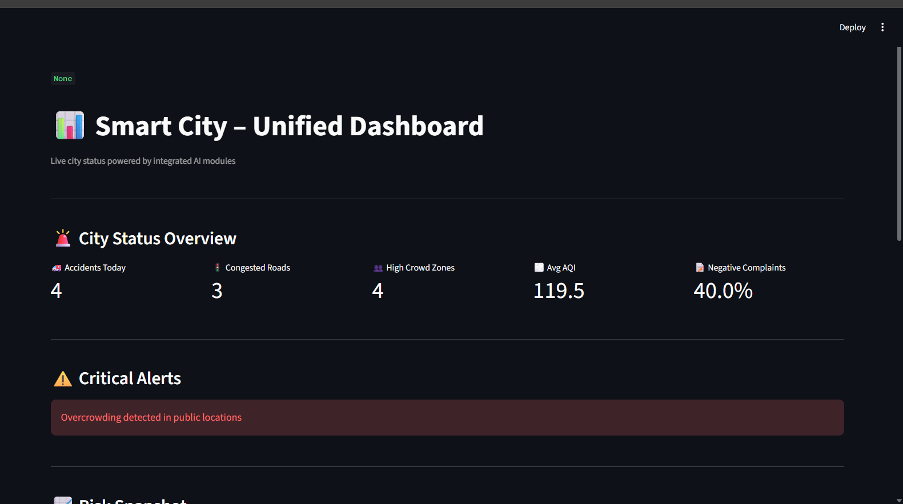
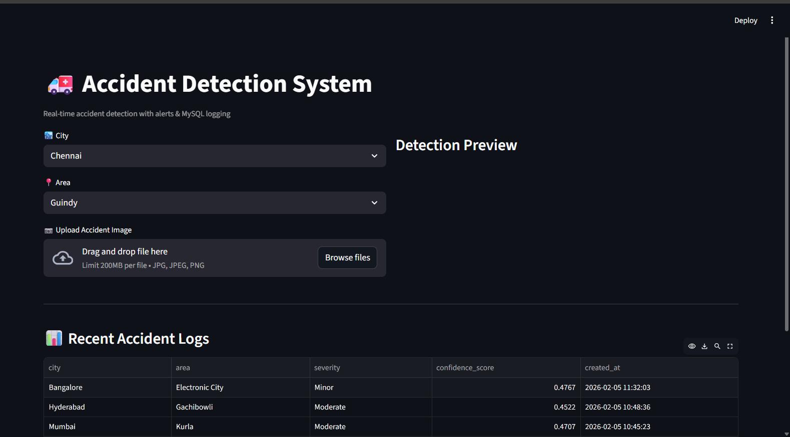
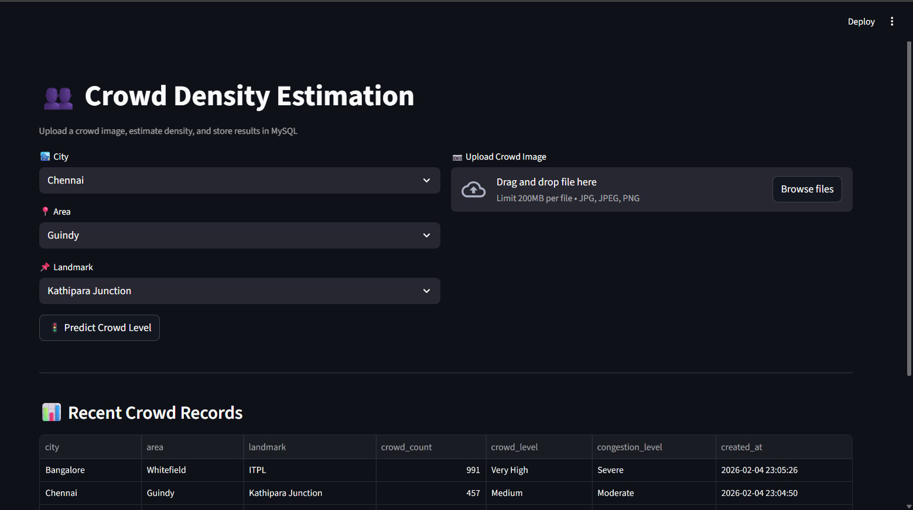
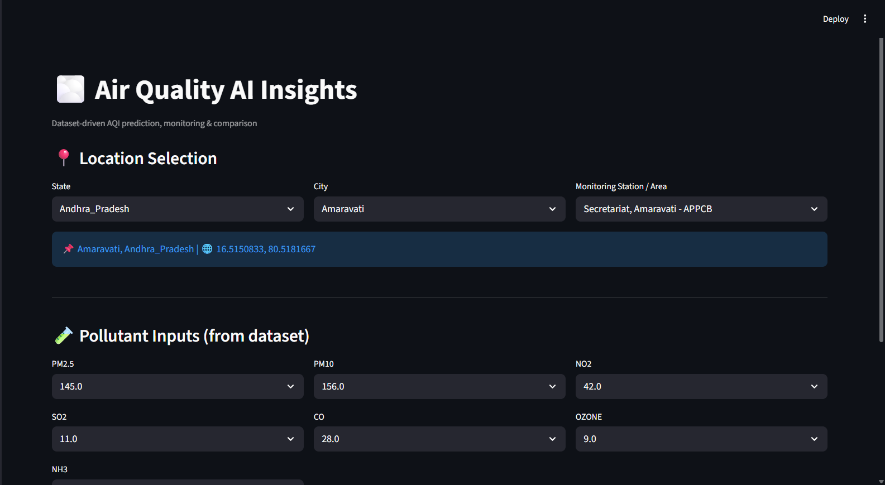
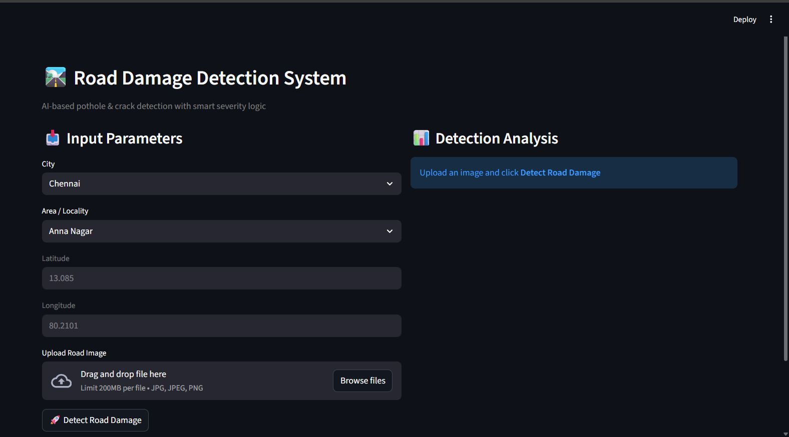
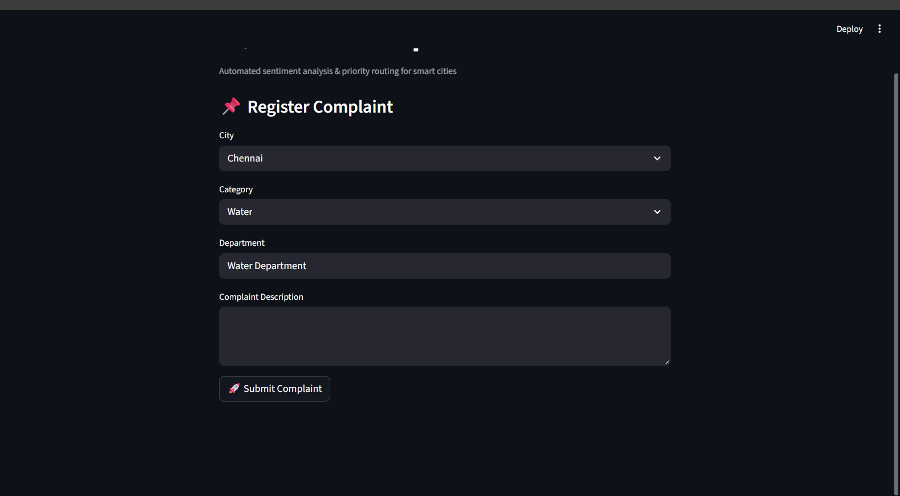
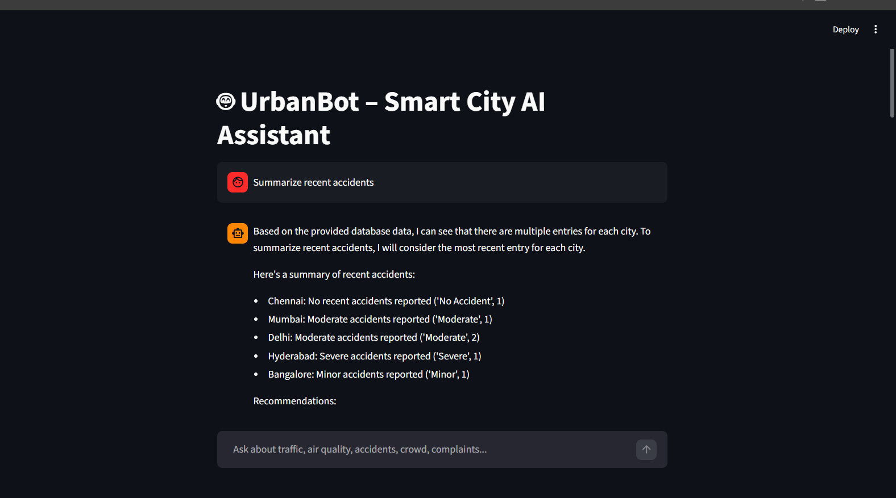

# 🏙️ UrbanBot – Smart City Intelligence 

UrbanBot is an end-to-end **AI-powered Smart City Intelligence System** designed to monitor, analyze, and assist urban infrastructure management in real time.

It integrates **Computer Vision, Machine Learning, NLP, MySQL, and LLM-based analytics** into a unified **Streamlit dashboard** to support data-driven decision-making for smart cities.

## 🚀 Key Highlights

- 🧠 Multi-AI system (Computer Vision + ML + NLP + LLM)
- 📊 Unified smart city monitoring dashboard
- 🗄️ Persistent MySQL database integration
- 📧 Automated email alerts for critical events
- 🤖 LLM-powered chatbot for city insights
- 🖥️ Production-style Streamlit UI
## 🧩 Core Modules
### 1️⃣ Smart City – Unified Dashboard

🌐 Live Cloud Deployment

The system is fully deployed on an AWS EC2 cloud server and accessible via the public internet.

🔴 Live Application:
http://15.207.178.9:8501

The AI models run on a remote cloud server and perform real-time inference.
No local installation is required — the application works directly from a browser.

Cloud Architecture

User Browser → Internet → AWS EC2 Server → Streamlit App → AI Models → MySQL Database

Centralized command center displaying live city-wide metrics.

- Accidents today  
- Traffic congestion  
- Crowd density hotspots  
- Average AQI  
- Citizen complaint sentiment  

### 2️⃣ Accident Detection System

AI-based road accident detection using YOLO.

- Upload accident images  
- Predict severity (No / Minor / Moderate / Severe)  
- Store logs in MySQL  
- Email alerts for critical accidents  

### 3️⃣ Crowd Density Estimation

Crowd analysis using deep learning to identify high-risk zones.

- Crowd count estimation  
- Congestion level classification  
- MySQL logging  

### 4️⃣ Air Quality AI Insights

Dataset-driven AQI prediction and monitoring.

- Pollutant-based AQI calculation  
- Location-wise insights  
- Health-level classification  

### 5️⃣ Road Damage Detection

AI-based pothole and crack detection.

- Upload road images  
- Severity classification  
- Infrastructure maintenance support  

### 6️⃣ Citizen Complaint Analysis

NLP-powered grievance handling system.

- Complaint registration  
- Sentiment analysis  
- Priority routing  

### 7️⃣ UrbanBot AI Chat Assistant

LLM-powered assistant for city administrators.

- Natural language queries  
- SQL-based reasoning  
- Summarizes city insights  

## 🛠️ Tech Stack

- **Frontend:** Streamlit  
- **Backend:** Python  
- **Computer Vision:** YOLO (Ultralytics)  
- **Machine Learning:** Scikit-learn  
- **NLP:** Sentiment Analysis  
- **LLM:** SQL Agent + Prompt Engineering  
- **Database:** MySQL  
- **Alerts:** SMTP (Gmail App Password)
## 👩‍💻 Author

**Dhivya J**  
AI / ML Engineer | Smart City Systems | Computer Vision | NLP  

.

